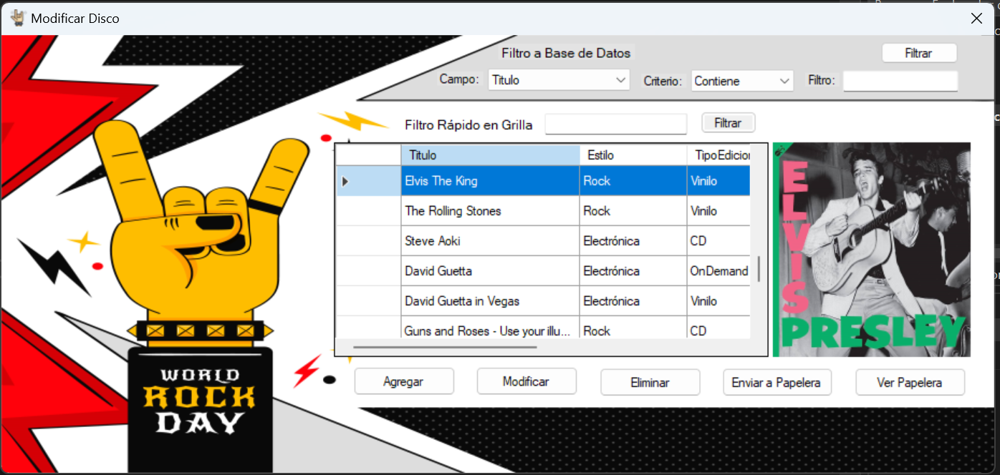
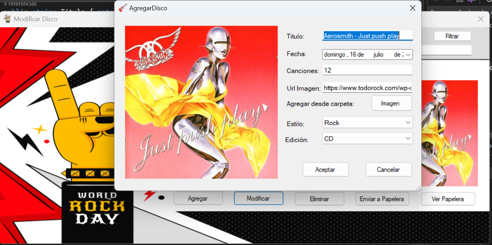

## Trabajo Práctico - Curso C# Nivel 2
Gestor de inventario de Discos en formato de aplicación de escritorio.

Los usuarios pueden realizar las tareas básicas de un CRUD (leer, modificar, crear y eliminar registros).

Se utilizó Programación orientada a objetos.

Posee 2 filtros para una búsqueda rápida de artículos.

Uno utiliza metodos de string para filtrar la grilla, y el otro utiliza consultas SQL a la base de datos.

Permite la carga de imágenes tanto desde la web como de una carpeta local.

Posee manejo de excepciones y validaciones para evitar errores.

Eliminación física y lógica de archivos.

Arquitectura en capas.

### Tecnologías utilizadas:
- C#
- .NET Framework 4.8
- Microsoft SQL Server
- Windows Forms
- ADO.NET

